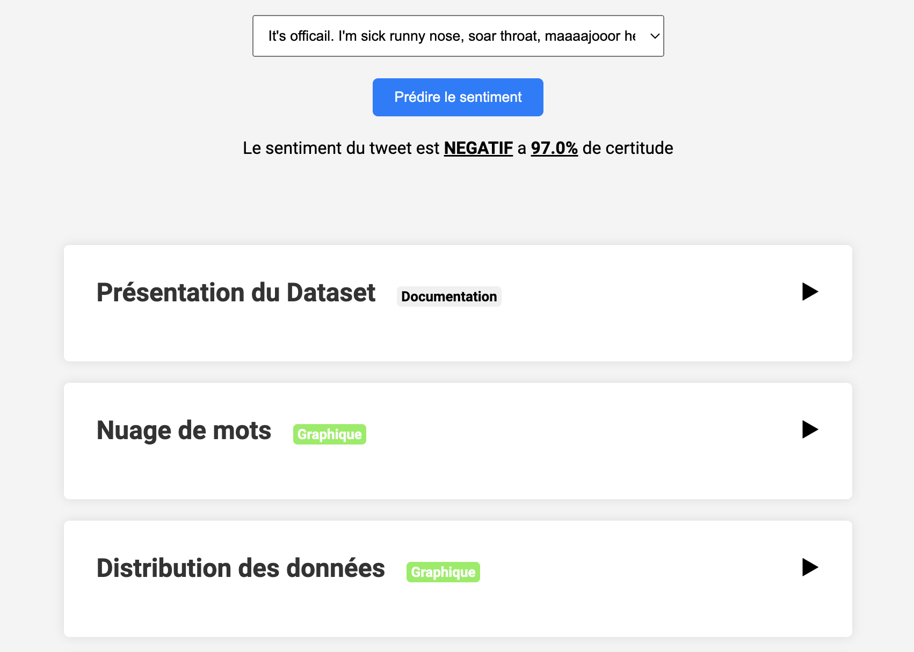

# APP roBERTa Dashboard

[](LICENSE)

Here is my roBERTa Dashboard using FastAPI which provides a simple and powerful interface to visualize my explanation of the model training and for testing the model.   

## Description  

This dashboard includes the explanations of the methodological note that I produced in order to evaluate different models for classifying the sentiment of a tweet. The objective is to show the advantages brought by the roBERTa model  



## Table of Contents

- [Getting Started](#Getting-Started)
- [Launch Application](#Launch-Application)
- [Contributing](#Contributing)
- [License](#License)  

## Getting Started  

You can't use my training model because of Github storage. But if you train your own model you can install and use my repository like this.  

```bash
git clone https://github.com/HaDock404/app-nlp-pretrained_roberta.git
cd app-nlp-pretrained_roberta
pip install -r ./packages/requirements.txt
```  

## Launch Application  

You can't use my training model because of Github storage. But if you train your own model you can install and use my repository like this.  

```bash
uvicorn main:app --reload
```  

## Contributing

Pull requests are welcome. For major changes, please open an issue first
to discuss what you would like to change.

Please make sure to update tests as appropriate.

## License  

This project is licensed under the MIT License - see the [LICENSE](./LICENSE) file for details.